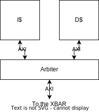
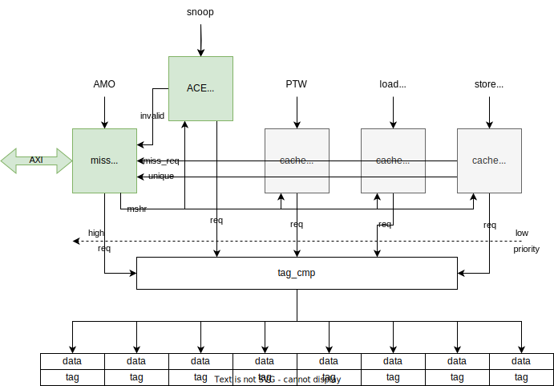
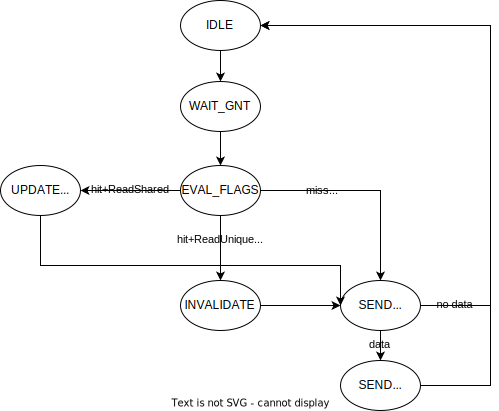
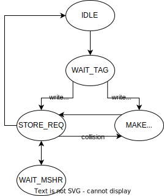

# Write-back cache extensions for snooping-based coherence

## Introduction

The CVA6 architecture, by default, employs a write-through cache strategy. While write-through caches guarantee data consistency by immediately updating the main memory, they often suffer from excessive traffic during write operations. This traffic can lead to higher memory access latency and slower system performance, particularly in scenarios where write-intensive workloads are prevalent. On the other hand, Write-back caches enhance system performance by reducing the memory access latency and improving overall efficiency. in this project, we are modifying the LSU of the CVA6 architecture to incorporate a write-back cache. However, implementing a write-back cache introduces the challenge of maintaining cache coherence in multi-processor systems. In this project, we are implementing a sophisticated cache coherency mechanism to boost the performance for dual-core/quad-core CVA6. In designing our cache coherence mechanism, we have selected an implementation scheme based on the ACE (AxCache Coherent Extensions) specifications, driven by the following motivations:

- **Compatibility:** By adopting ACE, we leverage an existing standardized framework, eliminating the need to invent a proprietary protocol and ensuring compatibility with other ACE-compliant systems.

- **Reduced Complexity:** Implementing a subset of the ACE specifications allows us to focus specifically on inter-CPUs communications, streamlining the design process and reducing overall complexity.

- **Scalability:** The ACE-based implementation serves as a solid foundation, enabling easy integration with a full-featured ACE interface in the future, accommodating potential scalability requirements.

- **Performance Focus:** Given our system\'s configuration with 2 or 4 CPUs, we prioritize the WB (Write-Back) cache strategy as it offers superior performance characteristics.

- **Write-Invalidate Protocol:** To maintain cache coherence, we choose the write-invalidate protocol, which aligns with the ACE specifications and ensures data consistency across caches when a processor writes to a memory location.

Regarding memory locations, we consider the following types:

-   **Shareable and Cacheable:** Memory locations that allow efficient read and write operations across multiple CPUs, ensuring effective data sharing and caching.

-   **Shareable but Non-Cacheable:** The usefulness of this configuration remains a question, requiring further analysis to determine its practical implications and potential benefits.

-   **Non-Shareable but Cacheable:** Memory locations that are not shared among processors but can be cached individually, improving performance for specific data access patterns.

-   **Non-Shareable and Non-Cacheable:** These memory locations, often associated with device access, bypass caching mechanisms to maintain data integrity.\

Based on the various types of memory locations mentioned above, we have identified specific scenarios for load/store operations from the master (cache controller). These scenarios have been summarized in a table, including the initial cache state, final cache state, and the outgoing transaction to the snoop master for each scenario.

## Master issuing a transaction 

| **Operation**            | **Type of data**             | **Cache initial status** | **Outgoing transaction** | **Snoop transaction** |                                                                                                                      | **Cache final status** |
| ------------------------ | ---------------------------- | ------------------------ | ------------------------ | --------------------- | -------------------------------------------------------------------------------------------------------------------- | ---------------------- |
| Read                     | cacheable                    | UC, UD, SC, SD           | \-                       | \-                    | trivial                                                                                                              | UC, UD, SC, SD         |
| Read                     | non-shareable, cacheable     | I                        | ReadNoSnoop              | \-                    | transaction forwarded to target                                                                                      | UC                     |
| Read                     | shareable, cacheable         | I                        | ReadShared               | ReadShared            | if a cache responds positively, use that data                                                                        | SC, SD                 |
|                          |                              |                          |                          |                       | use data from memory1                                                                                     | UC                     |
| Read                     | shareable, non-cacheable     | \-                       | ReadOnce                 | ReadOnce              | if a cache responds positively, use that data; otherwise, use data from memory1                           | \-                     |
| Read                     | non-shareable, non-cacheable | \-                       | ReadNoSnoop              | \-                    | transaction forwarded to target                                                                                      | \-                     |
| Write                    | non-shareable, cacheable     | I                        | ReadNoSnoop              | \-                    | trivial                                                                                                              | UD                     |
|                          | non-shareable, cacheable     | UC, UD                   | \-                       | \-                    | trivial                                                                                                              | UD                     |
| Write                    | shareable                    | SD, SC                   | CleanUnique              | CleanInvalid          | update cache at the end of snooping                                                                                  | UD                     |
| Write                    | shareable                    | UC, UD                   | \-                       | \-                    | trivial                                                                                                              | UD                     |
| Write                    | shareable                    | I                        | ReadUnique               | ReadUnique            | if a cache responds positively, use that data; otherwise, use data from memory1

Update the cache content | UD                     |
| Write                    | shareable, non-cacheable     | \-                       | WriteUnique              | CleanInvalid          | transaction forwarded to target                                                                                      | \-                     |
| Write                    | non-shareable, non-cacheable | \-                       | WriteNoSnoop             | \-                    | transaction forwarded to target                                                                                      | \-                     |
| Writeback after eviction |                              | SD, UD                   | WriteBack                | \-                    | data forwarded to memory                                                                                             | \-                     |

1.  it is possible to fetch data from memory while waiting for the response from the caches: this can save time but add unnecessary traffic towards the shared memory

## Master receiving a snoop transaction 

| **Incoming snoop transaction** | **Cache initial status** | **Cache final status** |                                   |
| ------------------------------ | ------------------------ | ---------------------- | --------------------------------- |
| ReadOnce                       | I                        | I                      | \-                                |
|                                | SC, SD, UC, UD           | SC,SD, UC, UD          | forward cache content             |
| ReadShared                     | I                        | I                      | \-                                |
|                                | SC, SD, UC, UD           | SC, SD                 | forward cache content             |
| CleanInvalid                   | I, SC, UC                | I                      | \-                                |
|                                | SD, UD                   | I-                     | Update memory content1 |
| ReadUnique                     | I                        | I                      | \-                                |
|                                | SC, SD, UC, UD           | I                      | transfer cache content            |

1.  Data transfer is necessary. A CleanInvalid is the result of a CleanUnique or WriteUnique
    1.  CleanUnique: the master has a copy of a the cacheline, the CleanInvalid results in a transfer of the ownership (Updating the shared memory would in this case be redundant).
    2.  WriteUnique: the master could write a portion of the cacheline, so the shared memory must be up-to-date.

## Cornercases

-   two masters want to write the same cache line
    -   2 competing CleanUnique transactions
    -   master 1 executes normally
    -   master 2 must issue a ReadUnique if it receives a CleanUnique colliding with the ongoing one
-   master 1 issues ReadUnique, master 2 issues CleanUnique
    -   same as above
-   risk of deadlock
    -   master 1 wait for the completion of the CleanUnique transaction
    -   master 2 receive a CleanInvalid while the miss\_handler is busy updating exactly the same cacheline which is invalidate by master 1
    -   =\> snoop requests must be processed with high prio

## Block diagram

The above block diagram shows the top-level view of the multicore processor used to test the cache coherency unit (CCU) under development.

The development will also affect the CPU.Icache and CPU.Dcache.

## Cache controller

The baseline implementation is straight forward. CVA6 has a single AXI port to access the rest of the system and a stream arbiter multiplexes the read and write requests generated by the caches (or directly by the CPU, if the caches are in fact bypassed).

-   Extend axi\_req and axi\_resp ports to support ACE (AxDOMAIN, AxCACHE, AxBAR, xACK, RRESP)
-   Add ace\_req and ace\_resp ports (for snooping)
    -   accepted snooping transactions: ReadOnce, ReadShared, ReadUnique, CleanInvalid
-   The controller can process contemporary requests coming from the CPU and the interconnect, if targeting different cache lines
-   The controller must arbitrate requests coming from the CPU and the interconnect, if targeting the same cache line
-   The arbiter must broadcast snooping messages towards the caches and merge answers towards the interconnect

## Data cache

The cache must be extended with

-   new port to support snooping requests
-   extend the miss\_handler to support line invalidation
-   extend the existing modules to send ACE information over AXI

## snoop\_cache\_ctrl

The diagram above represents the FSM of the cache controller module which processes the snooping requests:

-   the controller reacts upon read and invalidate requests coming from the interconnect

-   if the cache is active, the first step is to get the tags and flags for that cacheline (as performed by the cache\_ctrl - WAIT\_TAG)

    -   a request to the tag\_cmp is sent

-   in case of incoming read requests

    -   in case of cache hit and ReadUnique request, the target cacheline must be invalidated (INVALIDATE)

        -   a writeback is not necessary since there is an ownership transfer

    -   in case of cache hit and ReadShared request, the target cacheline must be marked as shared (UPDATE\_SHARED)

    -   data are sent to the interconnect only in case of read requests hitting a cacheline (SEND\_RESP)

-   in case of incoming invalidate request

    -   in case of a cache hit, the target cacheline must be invalidated (INVALIDATE)

    -   in case of dirty cacheline, a writeback is necessary

        -   this is not performed by the cache controller, but it delegates the interconnector by forwarding the hit cacheline data

-   unsupported snoop requests result in a snoop response with active error flag

### cache\_ctrl

Compared to the original version, the cache controller must be able to send CleanUnique transactions (through the miss\_handler, which controls the AXI interface), in case a write request hits a shared cacheline.

It might occur that a CleanUnique is sent while the cache controller receives (through snoop\_cache\_ctrl) a ReadShared transaction. In case the cache\_ctrl detects this situation (i.e. there has been a collision), the CleanUnique must be sent again and the status is set again to MAKE\_UNIQUE.

### miss\_handler

The diagram above represents the extension needed for the miss\_handler to support invalidate requests:

-   while in IDLE state, the miss\_handler also listens for make\_unique requests coming from the other cache controllers (to write cachelines which are not in UD or US state)
-   it might happen that a CleanInvalid or ReadUnique requests are received while the miss\_handler has started a ReadUnique or CleanUnique transaction (SEND\_CLEAN). In this case the cacheline must be requested again (MISS)

### Cornercases

-   Master1 starts start a CleanUnique/WriteUnique, master2 starts CleanUnique
    -   master1 is served first
    -   master2's requests reach the CCU
        -   it is too late for the miss\_handler to change the request type
        -   it waits for the CleanUnique to terminate
    -   master2 receives a CleanInvalid transaction colliding with its ongoing CleanUnique
    -   master2 can't skip the writeback, even if the if the cacheline is marked as shared: master1 might not have a copy of the cacheline (e.g. it started a WriteUnique transaction)
    -   master2's snoop\_cache\_ctrl notifies the invalidate request to the miss\_handler
    -   master2's miss\_handler (in SEND\_CLEAN state)
        -   immediately starts an invalidate (INVALID\_REQ\_STATUS-\>INVALIDATE-\>WB\_CACHELINE\_INVALID)
            -   this can be done in parallel to a CleanUnique (the writeback goes through the bypass interface)
            -   at the end of the writeback, the snoop\_cache\_ctrl notifies to the interconnect the success of the CleanInvalid transaction
        -   waits for its own CleanInvalid request to terminate (a response from the interconnect arrives for sure after the WriteBack)
            -   the response of the axi interface is registered, in case it arrives while the miss\_handler is performing the writeback
        -   starts a ReadUnique request (REQ\_CACHELINE-\>SAVE\_CACHELINE)
-   Master1 sends ReadUnique, master2 sends CleanUnique
    -   master1 is served first
    -   master2's requests reach the CCU
        -   it is too late for the miss\_handler to change the request type
        -   it waits for the CleanUnique to terminate
    -   master2 receives a CleanInvalid transaction colliding with its ongoing CleanUnique
    -   master2 can skip the writeback and transfer the cacheline to master1 via the snoop\_cache\_ctrl
    -   master2's snoop\_cache\_ctrl notifies the invalidate request to the miss\_handler
    -   master2's miss\_handler (in SEND\_CLEAN state)
        -   waits for its CleanInvalid request to terminate (a response from the interconnect arrives once master1 has finished its operations)
        -   starts a ReadUnique request (REQ\_CACHELINE-\>SAVE\_CACHELINE)
